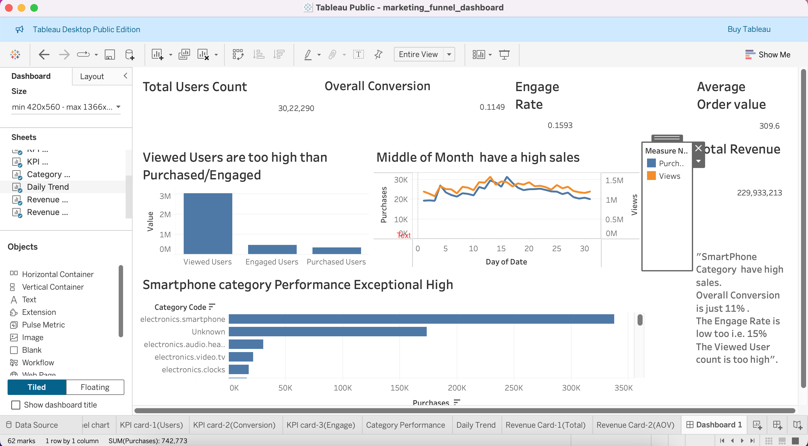

# 📊 E-Commerce Marketing Funnel Analysis

> **Data Science & Analytics Project — Future Intern (Task 3)**  
> Analysing user behaviour across the purchase journey using PostgreSQL and Tableau

---

## 📌 Project Overview

This project performs an end-to-end **marketing funnel analysis** on an e-commerce dataset. Starting from raw event-level data, the project cleans and transforms the data using SQL, derives key business metrics, and visualises the results in an interactive Tableau dashboard.

The goal is to understand **where users drop off** in the purchase journey — from first viewing a product to completing a purchase — and to identify which product categories and time periods drive the most revenue.

---

## 🗂️ Repository Structure

```
FUTURE_DS_03/
│
├── program_file/
│   └── ecommerce_marketing_funnel.sql   # All SQL queries (cleaning, analysis, export)
│
├── dashboard/
│   ├── data/
│   │   ├── category_performance.csv     # Funnel metrics per product category
│   │   ├── daily_trend.csv              # Daily views & purchases over 31 days
│   │   ├── revenue_summary.csv          # Total revenue & average order value
│   │   └── user_funnel.csv              # Per-user funnel stage classification
│   └── marketing_funnel_dashboard.twb   # Tableau workbook
│
├── marketing_funnel_dashboard.png        # Dashboard screenshot
├── .gitignore
└── README.md
```

---

## 🛠️ Tools & Technologies

| Tool | Purpose |
|------|---------|
| **PostgreSQL** | Data storage, cleaning, transformation, and metric calculation |
| **SQL** | Funnel queries, conversion rates, drop-off analysis, revenue aggregation |
| **Tableau Public** | Interactive dashboard for business-ready visualisation |
| **CSV** | Intermediate data exports for Tableau connection |

---

## 📐 Dataset Schema

The raw data is stored in a single `ecommerce` table capturing user-level behavioural events:

| Column | Type | Description |
|--------|------|-------------|
| `event_time` | TIMESTAMP | When the event occurred |
| `event_type` | VARCHAR(20) | Type of event: `view`, `cart`, or `purchase` |
| `product_id` | BIGINT | Unique product identifier |
| `category_id` | BIGINT | Unique category identifier |
| `category_code` | VARCHAR(100) | Human-readable category (e.g. `electronics.smartphone`) |
| `brand` | VARCHAR(100) | Product brand |
| `price` | DECIMAL(10,2) | Product price at time of event |
| `user_id` | BIGINT | Unique user identifier |
| `user_session` | VARCHAR(100) | Session identifier for the user |

---

## 🔧 Data Preparation (SQL)

All data preparation was performed in PostgreSQL. Key steps:

### 1. Missing Value Treatment
```sql
UPDATE ecommerce
SET category_code = 'Unknown'
WHERE category_code IS NULL;
```

### 2. Duplicate Removal
```sql
CREATE TABLE cleaned_data AS
SELECT DISTINCT * FROM ecommerce;
```

### 3. Funnel Stage Classification (User Level)
Each user was classified by the furthest stage they reached in the purchase journey:

```sql
CREATE TABLE user_funnel AS
SELECT
    user_id,
    MAX(CASE WHEN event_type = 'view'  THEN 1 ELSE 0 END) AS viewed,
    MAX(CASE WHEN event_type IN ('cart','purchase') THEN 1 ELSE 0 END) AS engaged,
    MAX(CASE WHEN event_type = 'purchase' THEN 1 ELSE 0 END) AS purchased
FROM cleaned_data
GROUP BY user_id;
```

---

## 📊 Key Metrics Computed

### Conversion Rates
```sql
SELECT
    COUNT(CASE WHEN event_type = 'view' THEN 1 END) AS views,
    COUNT(CASE WHEN event_type IN ('cart','purchase') THEN 1 END) AS engages,
    COUNT(CASE WHEN event_type = 'purchase' THEN 1 END) AS purchases,
    ROUND(
        COUNT(CASE WHEN event_type IN ('cart','purchase') THEN 1 END)*100.0 /
        COUNT(CASE WHEN event_type = 'view' THEN 1 END), 4
    ) AS view_to_engage_rate,
    ROUND(
        COUNT(CASE WHEN event_type = 'purchase' THEN 1 END)*100.0 /
        COUNT(CASE WHEN event_type IN ('cart','purchase') THEN 1 END), 4
    ) AS engage_to_purchase_rate,
    ROUND(
        COUNT(CASE WHEN event_type = 'purchase' THEN 1 END)*100.0 /
        COUNT(CASE WHEN event_type = 'view' THEN 1 END), 4
    ) AS overall_conversion_rate
FROM cleaned_data;
```

### Revenue Analysis
```sql
SELECT
    SUM(CASE WHEN event_type = 'purchase' THEN price ELSE 0 END) AS total_revenue,
    ROUND(AVG(CASE WHEN event_type = 'purchase' THEN price END), 2) AS avg_order_value
FROM cleaned_data;
```

---

## 📈 Key Findings

| Metric | Value |
|--------|-------|
| **Total Unique Users** | 30,22,290 |
| **Overall Conversion Rate** | 11.49% |
| **Engage Rate (View → Cart)** | 15.93% |
| **Total Revenue** | ₹22,99,33,213 |
| **Average Order Value (AOV)** | ₹309.6 |

### Funnel Drop-Off Summary

```
Views (3M+)  →  Engaged Users  →  Purchased Users
              ↓ ~84% drop-off      ↓ significant drop-off
```

- The **largest drop-off** occurs between viewing and engagement — only **~16%** of users who viewed a product added it to cart or proceeded further.
- Of those who engaged, a significant proportion still did not complete a purchase, indicating friction in the checkout experience.

### Category Performance

| Rank | Category | Purchases |
|------|----------|-----------|
| 1 | `electronics.smartphone` | ~350K |
| 2 | `Unknown` | ~250K |
| 3 | `electronics.audio.headphone` | ~60K |
| 4 | `electronics.video.tv` | ~55K |
| 5 | `electronics.clocks` | ~50K |

> **Smartphones dominate** the purchase funnel, accounting for the highest transaction volume by a significant margin.

### Daily Trend Insight

- Sales activity peaks **around the middle of the month** (days 10–20), with a gradual decline towards month-end.
- Views consistently and substantially exceed purchases throughout the month, confirming low conversion at scale.

---

## 📉 Dashboard Visualisations

The Tableau dashboard (`marketing_funnel_dashboard.twb`) contains:

| Sheet | Chart Type | Insight |
|-------|-----------|---------|
| **Funnel Chart** | Horizontal Bar | Compares Viewed, Engaged, and Purchased user counts |
| **Daily Trend** | Dual-axis Line Chart | Views vs Purchases over 31 days |
| **Category Performance** | Horizontal Bar | Purchases ranked by product category |
| **KPI — Total Users** | Scorecard | 30,22,290 unique users |
| **KPI — Overall Conversion** | Scorecard | 11.49% |
| **KPI — Engage Rate** | Scorecard | 15.93% |
| **Revenue — Total** | Scorecard | ₹22,99,33,213 |
| **Revenue — AOV** | Scorecard | ₹309.6 |



---

## 💡 Business Recommendations

1. **Reduce View-to-Cart Drop-off:** With ~84% of viewers never engaging, consider personalised recommendations, urgency triggers (e.g. low-stock alerts), and improved product page UX.

2. **Optimise the Checkout Flow:** The gap between engaged and purchased users suggests friction in the cart-to-checkout journey. Streamlining checkout steps or offering guest checkout could improve conversion.

3. **Invest in the Smartphone Category:** Electronics, especially smartphones, drive the most purchases. Targeted promotions and inventory management in this category will yield the highest ROI.

4. **Mid-Month Campaign Timing:** Sales peak in the middle of the month. Scheduling flash sales, email campaigns, and discounts around days 10–15 is likely to amplify conversion.

5. **Investigate "Unknown" Category:** The second-highest purchase volume comes from products with unclassified category codes. Proper categorisation would enable more precise targeting and deeper funnel analysis.

---

## 🚀 How to Run This Project

### Prerequisites
- PostgreSQL (v13 or later)
- Tableau Public (free) or Tableau Desktop

### Steps

1. **Clone the repository**
   ```bash
   git clone https://github.com/Vijay2705bp/FUTURE_DS_03.git
   cd FUTURE_DS_03
   ```

2. **Load the dataset into PostgreSQL**
   - Create the `ecommerce` table using the schema in `program_file/ecommerce_marketing_funnel.sql`
   - Import your raw CSV data using `COPY` or pgAdmin's import tool

3. **Run the SQL script**
   ```bash
   psql -U your_username -d your_database -f program_file/ecommerce_marketing_funnel.sql
   ```

4. **Export CSV files** (already available in `dashboard/data/` for reference)

5. **Open the Tableau workbook**
   - Open `dashboard/marketing_funnel_dashboard.twb` in Tableau Public
   - Update data source file paths to match your local directory if needed

---

## 📁 Output Files

| File | Rows | Description |
|------|------|-------------|
| `category_performance.csv` | 127 | Product categories with views, engages, and purchases |
| `daily_trend.csv` | 31 | Daily time series of views and purchases |
| `revenue_summary.csv` | 1 | Summary of total revenue and average order value |
| `user_funnel.csv` | ~3M | Per-user classification by funnel stage reached |

---

## 👨‍💻Author - Vijaya Kumar Kanipakam

This project is part of my portfolio, showcasing the SQL skills essential for data analyst/Analyst/SQL/data scientist roles. If you have any questions, feedback, or would like to collaborate, feel free to get in touch!

### Stay Updated and Join the Community

For more content on SQL, data analysis, and other data-related topics, make sure to follow me on social media and join our community:

- **LinkedIn**: [Connect with me professionally](https://www.linkedin.com/in/vijay-kumar-2705m/)

Thank you for your support, and I look forward to connecting with you!
